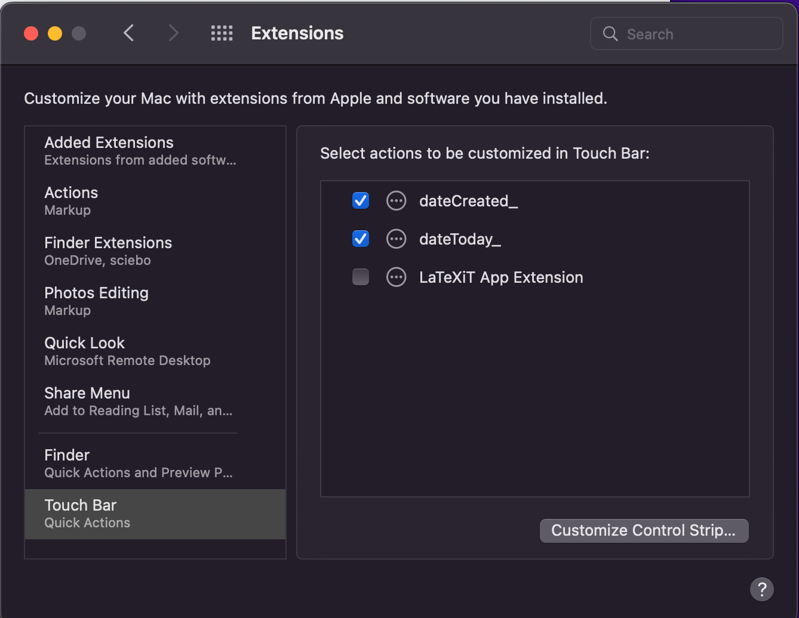
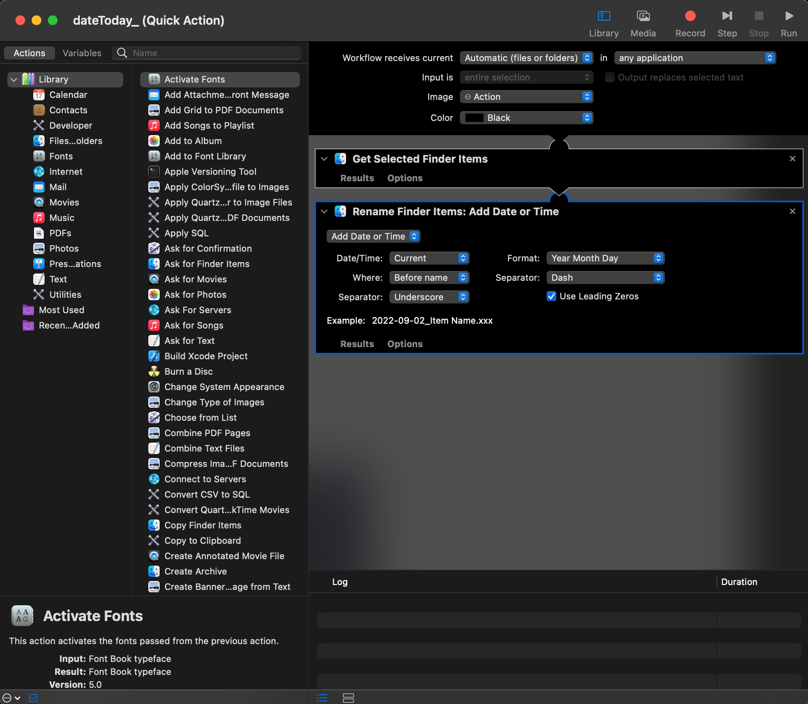

# MacBook Touch Bar Quick Actions

This repository holds my favorite quick actions for file handling.
By just a click (finger-tip) in your touch bar, ...
   - ... `dateCreated_.workflow` prepends **the file's creation date** to the file name.
   - ... `dateToday_.workflow` prepends **today's** date to the file name.

These dates are added [ISO8601](https://en.wikipedia.org/wiki/ISO_8601)-compliant (YYYY-MM-DD).

<figure>
  
  <figcaption align = "left">
https://www.reddit.com/r/ProgrammerHumor/comments/uptfy9/dating_a_programmer/
</figcaption>
</figure>

vertical-align: middle

Quick actions are special types of macOS "Automator workflows". Somewhat intuitive to design and customize via the "Automator" app.

- [Add quick actions to your touch bar](#add-quick-actions-to-your-touch-bar)
- [Copy quick actions to your system](#copy-quick-actions-to-your-system)
- [Test](#test)
- [Warning](#warning)
- [Customize](#customize)
- [Source](#source)

## Add quick actions to your touch bar

1. Open the System Preferences "Keyboard"
   1. Via clicking or 
   2. Via terminal: `open -b com.apple.systempreferences /System/Library/PreferencePanes/Keyboard.prefPane`

1. Check the box "Show Control Strip"

2. Open the menu to "Customize Control Strip"

4. Add "Quick Actions" to your touch bar by drag-and-drop.

## Copy quick actions to your system

1. Navigate to  `~/Library/Services`
   1. Via terminal: `open ~/Library/Services` or 
   2. Via finder, go to (<kbd> &#8984; </kbd>+<kbd>&#8679;</kbd>+<kbd> G </kbd>), copy-paste `~/Library/Services`, enter.

2. Copy the quick actions from this repository to the folder `~/Library/Services`

3. The new quick actions should now appear in your "Extensions" System Preferences, open them
      1. via clicking there or ... 
      2. via terminal: `open -b com.apple.systempreferences /System/Library/PreferencePanes/Extensions.prefPane`

## Test

1. Open a finder window and select one or multiple files or folders
2. Click the quick actions menu in your touch bar

3. and use one of the Quick Actions on the files.

## Warning

Quick actions on files and folders will be done twice without a warning: already have a prepended date? => double date: 2022-09-01_2022-09-01_fileName.txt

## Customize

In the `~/Library/Services` double-click one of the workflows to open it in "Automator" and adapt it to your needs or create a new one.

## Source

Tutorial adapted from: https://www.idownloadblog.com/2020/01/07/run-quick-actions-touch-bar-mac-tutorial/

<figure>
  
  <figcaption align = "left">
https://xkcd.com/1179
</figcaption>
</figure>